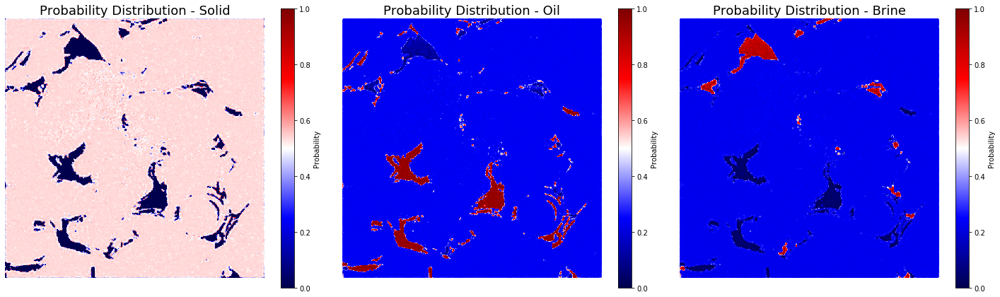
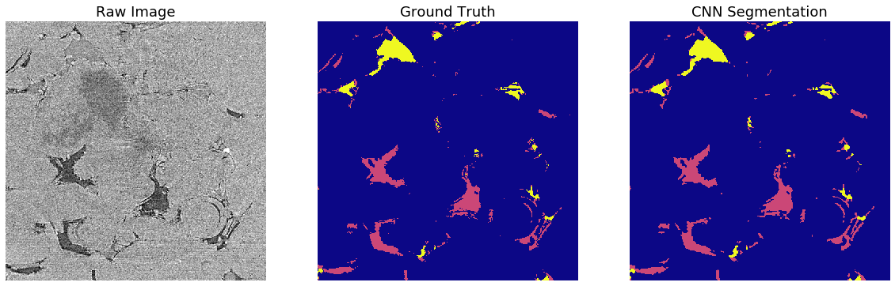

# CNN-coreflooding-muCT
Segment core-flooding micro-CT images using CNN. 

This work uses the U-Net architecture implemented by : https://github.com/jvanvugt/pytorch-unet

Training template and example : https://yclipse.github.io/CNN-core-flooding-muCT/

The trained model can be downloaded via : https://drive.google.com/file/d/18-Gna1Xr8JFSIsWGmflSBow3VkO8tS1B/view?usp=sharing

Tutorial for muCT image processing and segmentation using scikit-image please visit : https://github.com/yclipse/muCTimage_processing_tutorial


### Prerequisite 
PyTorch

CUDA toolkit (enable GPU acceleration)

### Example CNN architecture


### Training template and example

This document is a training code template that only used 10 training images and trained for 50 epochs for tutorial purpose. 

Users can test this code using the training images from https://github.com/yclipse/CNN-core-flooding-muCT.

Users can use their own dataset to train a CNN segmentation model for CT images, add customised functions and fine-tune the parameters for the best result.

#### Import modules


```python
%matplotlib inline
#import from installed python libraries
import torch
import os
import os.path
import torch.nn as nn
import torch.nn.functional as F
import matplotlib.pyplot as plt
import numpy as np
import glob
from PIL import Image
# import sys
# from joblib import Parallel, delayed
# import time
# import scipy.misc
print ('modules imported')

#import from local ipynb file
from ipynb.fs.full.function_kits import test_availability,im2array,imview,im_compare,rescale
from .defs.Unet import UNet

test_availability()
print (torch.cuda.is_available())
print ('torch Ver .', torch.__version__)
```

    modules imported
    toolbox functions available
    toolbox functions available
    True
    torch Ver . 1.0.0
    

#### Import the CT image files, and their corresponding ground truth images


```python
img_dir='N:/CNN_SEG/figures/example/img/'
gt_dir='N:/CNN_SEG/figures/example/gt'
img_list=sorted(glob.glob(os.path.join(img_dir,'*.tif')))
gt_list=sorted(glob.glob(os.path.join(gt_dir,'*.tif')))
```

#### Split the images into a training dataset, a validation dataset and a test dataset. Here I produced a 80%: 10%: 10% split. And pair each image with its corresponding ground truth.


```python
train_set=(img_list[:8],gt_list[:8])
val_set=(img_list[8:9],gt_list[8:9])
test_set=(img_list[-1:],gt_list[-1:])
```

#### The following two functions convert each image file into 'tensor' that is a multi-dimensional matrix containing elements of a single data type. It is basically the pytorch version of numpy array. The images are down-sampled (2x2 mean pooling) and cropped into a suitable size for the GPU. You need to adjust the code to fit the size of your own data and GPU.


```python
from skimage.measure import block_reduce
def img2tensor(file,unsqueeze=False):
    img=Image.open(file)
    ####################################################change this block according to your own data size and make some pre-processing
    imarray=np.asarray(img)[110:1582,100:1572]
    downsample=block_reduce(imarray, block_size=(2,2), func=np.mean)[120:616,120:616]
    imarray_rescale=rescale(downsample)
    imtensor = torch.from_numpy(imarray_rescale).type(torch.float)
    ####################################################change this block according to your own data size and make some pre-processing
    if unsqueeze==True:
        imtensor =  torch.unsqueeze(imtensor, dim=0)
    return imtensor
def label2tensor(file):
    img=Image.open(file)
    ####################################################change this block according to your own data size and make some pre-processing
    imarray=np.asarray(img)[110:1582,100:1572]
    downsample=block_reduce(imarray, block_size=(2,2), func=np.mean)[120:616,120:616]
    labels=np.zeros(downsample.shape)
    labels[downsample==0]=0#bg       #the groundtruth image is labelled with 0-127-255 for three classes, here I converted them to 1-2-3
    labels[downsample==127]=1#oil
    labels[downsample==255]=2#brine
    ####################################################change this block according to your own data size and make some pre-processing
    imtensor = torch.from_numpy(labels).type(torch.float)
    return imtensor
```

#### Define the Data_imoprter function to import the dataset into the CNN model when initialising training


```python
from torch.utils.data import Dataset, DataLoader
class Data_importer(Dataset):
    """
    A customized data loader.|
    """
    def __init__(self, datalist,labellist):
        """ Intialize the dataset
        """
        self.x_data=datalist
        self.y_data=labellist
        self.len = len(datalist)
        
    # You must override __getitem__ and __len__
    def __getitem__(self, index):
        """ Get a sample from the dataset
        """
        traintensor= img2tensor(self.x_data[index],unsqueeze=True)
        labeltensor= label2tensor(self.y_data[index])
        #
        return traintensor,labeltensor.long()

    def __len__(self):
        """
        Total number of samples in the dataset
        """
        return self.len
```

### Define some Evaluation functions

#### Receiver operating characteristic (ROC)
>ROC curve is a graphical plot that illustrates the diagnostic ability of a binary classifier system as its discrimination threshold is varied.

>The ROC curve is created by plotting the true positive rate (TPR) against the false positive rate (FPR) at various threshold settings. The true-positive rate is also known as sensitivity, recall or probability of detection in machine learning

> TP = True positive; FP = False positive; TN = True negative; FN = False negative

#### precision, recall, accuracy and F1 score
>precision: tp / (tp + fp)  => how many selected items are relevant?

>recall: tp / (tp + fn)  => how many relevant items are selected?

>F1:  harmonic mean of precision and recall

>accuracy:(tp + tn) / (tp + tn + fp + fn)   => the proportion of true results (both true positives and true negatives) among the total number of cases examined

#### Intersection over Union (IOU)
>Intersection :area of overlap between the predicted area and the ground-truth area

>Union:  the area encompassed by both the predicted area and the ground-truth area.
 
>IOU = Intersection/Union
>


```python
def eval_metrics(pred,gt):
    tp=((pred == 1) & (gt == 1)).sum()
    # TN    predict 0 label 0
    tn=((pred == 0) & (gt == 0)).sum()
    # FN    predict 0 label 1
    fn=((pred == 0) & (gt == 1)).sum()
    # FP    predict 1 label 0
    fp=((pred == 1) & (gt == 0)).sum()
#   precision=tp/ (tp + fp)
#   recall = tp/ (tp + fn)
#   F1 = 2 * (recall*precision) / (recall+precision)
    rand = (tp + tn) / (tp + tn + fp + fn)  #rand index
    iou = tp / (tp + fp + fn)   #Intersection over Union
    return rand, iou
```

#### The CNN model output is a prediction of scores of each pixel belonging to a class. We use the softmax function to convert the scores into probabilities that are values between 0 and 1, and the three classes add up to 1. We classify the pixels with the largest probability of each class. This function below essentially convert the CNN prediction into segmentation labels.


```python
def prob_to_labels(prediction):
    m = nn.Softmax2d() 
    prob=m(prediction)
    seg_labels=np.zeros(prob.cpu().detach().numpy()[0][0].shape)
    rock=prob.cpu().detach().numpy()[0][0]
    oil=prob.cpu().detach().numpy()[0][1]
    brine=prob.cpu().detach().numpy()[0][2]
    seg_labels[rock-oil-brine>0]=0
    seg_labels[oil-rock-brine>0]=1
    seg_labels[brine-oil-rock>0]=2
    return seg_labels
```

#### These two functions below will produce the rand index of each phase and the mean IoU as measurements of segmentation quality


```python
import statistics
def threephase_accuracy(phase,seg_labels,gt):
    p={'rock':0,'oil':1,'brine':2}
    rand,iou=eval_metrics(seg_labels==p[phase],gt==p[phase])
    return rand,iou
def measure_accuracy(prediction,y):
    seg_labels=prob_to_labels(prediction)
    gt=y.cpu().detach().numpy()[0] 
    rand_rock,iou_rock=threephase_accuracy(phase='rock',seg_labels=seg_labels,gt=gt)
    rand_oil,iou_oil=threephase_accuracy(phase='oil',seg_labels=seg_labels,gt=gt)
    rand_brine,iou_brine=threephase_accuracy(phase='brine',seg_labels=seg_labels,gt=gt)
    mean_accuracy=statistics.mean([rand_rock,rand_oil,rand_brine])
    mean_iou=statistics.mean([iou_rock,iou_oil,iou_brine])
    return  rand_rock,rand_oil,rand_brine,mean_iou


```

#### Initialise training, load the data using the Data_importer and DataLoader functions. 


```python
train_dataset=Data_importer(train_set[0],train_set[1])
train_loader=DataLoader(train_dataset,
                        batch_size=1,
                        shuffle=False,
                        num_workers=0
                       )

val_dataset=Data_importer(val_set[0],val_set[1])
val_loader=DataLoader(val_dataset,
                        batch_size=1,
                        shuffle=False,
                        num_workers=0
                       )
```

### Hyperparameters are pre-defined parameters that controls the overall learning behaviour of the CNN model

#### Epoch and mini-batch
Use multiple epochs to train the same dataset multiple times. (often use shuffle to change traning sequence to get better resutls.)  
Use batch_size to slice data into mini-batches
#### Learning rate
Learning rate controls the step size of learning. 
#### Batch normalisation L2
Use batch normalisation to make activation funtion more sensitive
#### Optimizer
make training faster  
adam > RMSprop > Momentum > SGD


```python
EPOCHS = 50          # Use multiple epochs to train the same dataset multiple times. 
BATCH_SIZE = 1            #Use batch_size to slice data into mini-batches
LR = 5e-5              # learning rate try  1e-4 later
L2_penalty=1e-5        #add a L2 penalty (regulisation) to alleviate over-fitting
```

#### We use CUDA to enable GPU acceleration, import the U-Net model, and apply an Adam optimizer


```python
device = torch.device('cuda' if torch.cuda.is_available() else 'cpu')
model = UNet(in_channels=1, n_classes=3, depth=5, wf=6, padding=True,
                 batch_norm=True, up_mode='upconv').to(device)     #batch normalisation: To increase the stability of a neural network
optim = torch.optim.Adam(model.parameters(),lr=LR, weight_decay=L2_penalty)  # accelerate gradient descent using Adam
```

#### Define some empty list to record the training loss and accuracy during training


```python
dic=["rand_rock","rand_oil","rand_brine",'mean_iou']
eval_dic={}
ave_acc={}
train_loss_rec=[]
val_loss_rec=[]
train_loss_ave=[]
val_loss_ave=[]
for i in range(len(dic)):
    eval_dic[dic[i]]=[]
    ave_acc[dic[i]]=[]

def ave_list(lst):
    return sum(lst)/len(lst)
```

#### Start training
Validation at the end of each training epoch. You can also do validation for every n epochs if you have many training epochs.
The loss scores and accuracy measurements are printed every epoch to track the training process.


```python
print('start training')    

for epoch in range(EPOCHS):
        ###################
        # train the model #
        ###################
    model.train()

    for iteration, (x,y) in enumerate(train_loader):
        x=x.to(device)
        y=y.to(device)
        x =  torch.autograd.Variable(x)
        y =  torch.autograd.Variable(y)
        prediction = model(x)  # [N, 2, H, W]
        #get loss
        loss = F.cross_entropy(prediction, y)
        train_loss_rec.append(loss.data.cpu().detach().numpy())
        optim.zero_grad()
        loss.backward()
        optim.step()
        sys.stdout.write('\r epoch {}  training {} steps  train loss: {}'.format(epoch, iteration+1,loss.data.cpu().detach().numpy())) #print text progress
        sys.stdout.flush()
        
    print ('\r saving model..')
    torch.save(model.state_dict(), 'N:\\CNN_SEG\\CODES\\Unet_example_epoch{}.pth'.format(epoch)) 
    
        ######################    
        # validate the model #
        ######################
         #end of each training epoch
    if epoch%1==0: #every 1 epoch validation 
        #save in every 1 epochs

        print ('\r validating..')
        #epoch_train_loss.append(loss.data.cpu().detach().numpy())
        
        model.eval()
        for i,(val_x,val_y) in enumerate(val_loader):
            val_x=val_x.to(device)
            val_y=val_y.to(device)
            val_x =  torch.autograd.Variable(val_x)
            val_y =  torch.autograd.Variable(val_y)
            val_prediction = model(val_x)  # [N, 2, H, W]
            val_loss = F.cross_entropy(val_prediction, val_y)
            val_loss_rec.append(val_loss.data.cpu().detach().numpy())
            #get accuracy
            tuple_dic=(rand_rock,rand_oil,rand_brine,mean_iou)=measure_accuracy(val_prediction,val_y)
            #print progress 
            sys.stdout.write('\r validating {} steps'.format(i+1)) #print text progress
            sys.stdout.flush()
            for i in range(len(dic)):
                eval_dic[dic[i]].append(tuple_dic[i])
        for i in range(len(dic)):
            ave_acc[dic[i]].append(ave_list(eval_dic[dic[i]]))
        #plot eval accuracy
        fig, axes = plt.subplots(ncols=1,nrows=2)
        fig.set_size_inches(20, 8)
        ax1,ax2=axes
        #validation accuracy
        for i in range(len(dic)):
            ax1.plot(range(len(ave_acc[dic[i]])),ave_acc[dic[i]],'.-',label=dic[i],linewidth=6-i)
        ax1.legend(loc=(1,0.5))  
        #validation loss
        train_loss_ave.append(ave_list(train_loss_rec))
        val_loss_ave.append(ave_list(val_loss_rec))
        ax2.plot(range(epoch+1),train_loss_ave,'.-',label='train_loss')
        ax2.plot(range(epoch+1),val_loss_ave,'.-',label='val_loss')
        ax2.legend()
        plt.savefig('N:/CNN_SEG/figures/example/train_val_history_epoch{}.png'.format(epoch+1), bbox_inches='tight')
        plt.pause(0.05)
```

>
 validating..aining 8 steps  train loss: 0.6303515434265137

#### Visualise the probability of each class


```python
m=nn.Softmax2d()
prob=m(prediction)
brine=prob.cpu().detach().numpy()[0][2]
oil=prob.cpu().detach().numpy()[0][1]
solid=prob.cpu().detach().numpy()[0][0]

fig, axes = plt.subplots(nrows=1,ncols=3)
ax0, ax1,ax2 = axes

ax0.imshow(solid)
ax0.set_title('Probability Distribution - Solid',fontsize=18)
ax0.axis('off')
ax1.imshow(oil)
ax1.set_title('Probability Distribution - Oil',fontsize=18)
ax1.axis('off')
ax2.imshow(brine)
ax2.set_title('Probability Distribution - Brine',fontsize=18)
ax2.axis('off')       

fig.set_size_inches(20, 14)


cax2 = ax2.imshow(brine, interpolation='nearest', vmin=0, vmax=1,cmap='seismic')
cax1 = ax1.imshow(oil, interpolation='nearest', vmin=0, vmax=1,cmap='seismic')
cax0 = ax0.imshow(solid, interpolation='nearest', vmin=0, vmax=1,cmap='seismic')

cb0 = fig.colorbar(cax0,ax=ax0,shrink=0.4)  
cb1 = fig.colorbar(cax1,ax=ax1,shrink=0.4)
cb2 = fig.colorbar(cax2,ax=ax2,shrink=0.4)  


cb0.ax.set_ylabel('Probability', rotation=90)
cb1.ax.set_ylabel('Probability', rotation=90)
cb2.ax.set_ylabel('Probability', rotation=90)

fig.subplots_adjust(left=None, bottom=None, right=None, top=None, wspace=None, hspace=None)
fig.tight_layout()
```





#### Check segmentation image result


```python
def imgresult(x,y,pred):
    raw=x.cpu().detach().numpy()[0][0]
    gt=y.cpu().detach().numpy()[0]
    seg_labels=prob_to_labels(prediction)
    
    fig, axes = plt.subplots(nrows=1,ncols=3)
    ax0, ax1,ax2 = axes

    ax0.imshow(raw,cmap='gray')
    ax0.set_title('Raw Image',fontsize=18)
    ax0.axis('off')
    ax1.imshow(gt,cmap='plasma')
    ax1.set_title('Ground Truth',fontsize=18)
    ax1.axis('off')
    ax2.imshow(seg_labels,cmap='plasma')
    ax2.set_title('CNN Segmentation',fontsize=18)
    ax2.axis('off')       
    fig.set_size_inches(20, 14)
    plt.pause(0.01)
    
```


```python
imgresult(x,y,prediction)
```





#### Testing


```python
model_test = UNet(in_channels=1, n_classes=3, depth=5, wf=6, padding=True,
                 batch_norm=True, up_mode='upconv').to(device)
#model_test.load_state_dict(torch.load('8.pth'))
```


```python
test_dataset=Data_importer(test_set[0],test_set[1])
test_loader=DataLoader(test_dataset,
                        batch_size=BATCH_SIZE,
                        shuffle=True,
                        num_workers=0
                       )
```


```python
test_dic={}
test_ave_acc={}
for i in range(len(dic)):
    test_dic[dic[i]]=[]
    test_ave_acc[dic[i]]=[]

print('start testing')
model_test.eval()
for i,(test_x,test_y) in enumerate(test_loader):
    test_x=test_x.to(device)
    test_y=test_y.to(device)
    test_x =  torch.autograd.Variable(test_x)
    test_y =  torch.autograd.Variable(test_y)
    test_prediction = model_test(test_x)  # [N, 2, H, W]
    
    #get accuracy
    tuple_dic=(rand_rock,rand_oil,rand_brine,mean_iou)=measure_accuracy(test_prediction,test_y)

    for i in range(len(dic)):
        test_dic[dic[i]].append(tuple_dic[i]) 


for i in range(len(dic)):
    test_ave_acc[dic[i]].append(ave_list(test_dic[dic[i]]))
#print test accuracy
print(test_ave_acc)
```

    start testing
    {'rand_rock': [0.943792273673257], 'rand_oil': [0.9619252406347555], 'rand_brine': [0.9818670330385015], 'mean_iou': [0.31459742455775236]}
    


```python

```


